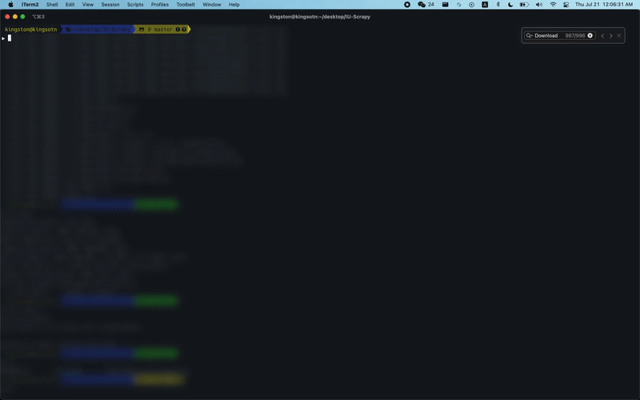

<!-- GETTING STARTED -->
# IU Python Scraper!

### Introduction
A script written in python using <a href="https://github.com/scrapy/scrapy">Scrapy</a> that downloads all images from http://iustudio.net/

### Why Scrapy?

Scrapy is a crawler. Beautiful Soup is pretty good for standard parsing, but only for contents in the url you provide — which isn't as robust as Scrapy.

## Getting Started

Follow the installation guide below if you want to mess around with the code. Otherwise you could just grab the <a href="https://github.com/kingsotn/IU-Scrapy/tree/master/iu_scrape/image_downloads">image_downloads</a> file if you want IU photos exclusively.

### Installation

1. For dependecies, I recommend downloading with conda see documentation https://docs.scrapy.org/en/latest/intro/install.html. The following code explains how to create a virtual environment and install dependecies to run this spider
  ```
  python3 -m venv venv
  source venv/bin/activate
  pip3 install -r requirements.txt
  scrapy crawl paris
  ```
2. Clone the repo
   ```sh
   git clone https://github.com/kingsotn/IU-Scrapy.git
   ```
3. Run inside the directory
  ```sh
  scrapy crawl iu
  ```


## Demo



<!-- USAGE EXAMPLES -->
## Tips
- There are no duplicates, this is accounted for in the Scrapy pipelines
- I suggest not modifying (deleting or adding) to the image_downloads folder.
- There are no duplicates when running the file multiple times, this is accounted for in the Scrapy pipelines
- If you want to modify your image stash, I suggest copying the image_downloads file and modifying somewhere else on your computer
- currently everything is stored in jpg files, ping me if you want other file support

_For more examples, please refer to the Scrapy [Documentation](https://docs.scrapy.org/en/latest/)_

<!-- LICENSE -->
## License

Distributed under the MIT License. See `LICENSE.txt` for more information.
